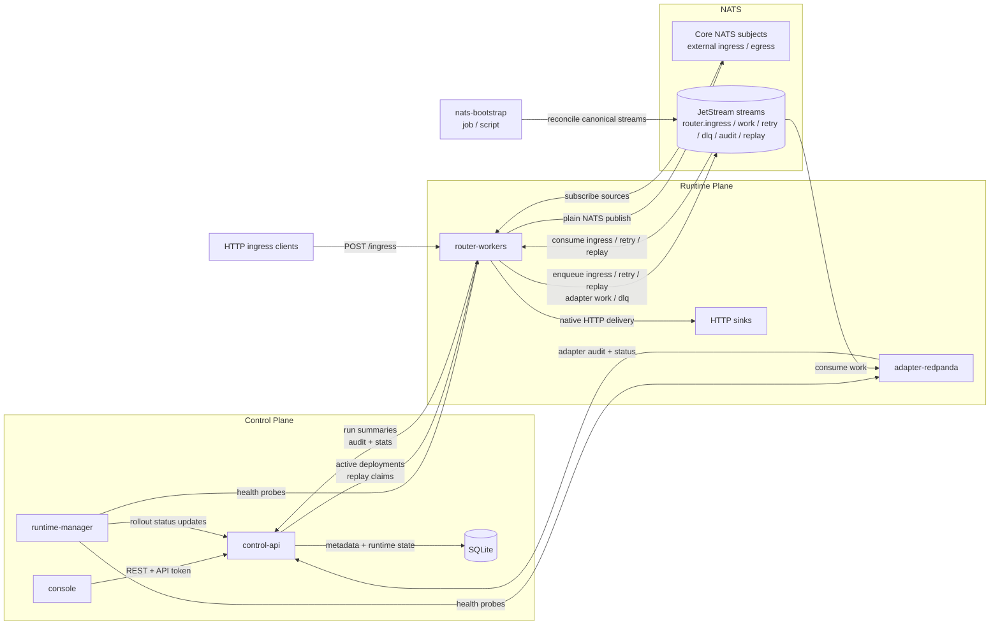
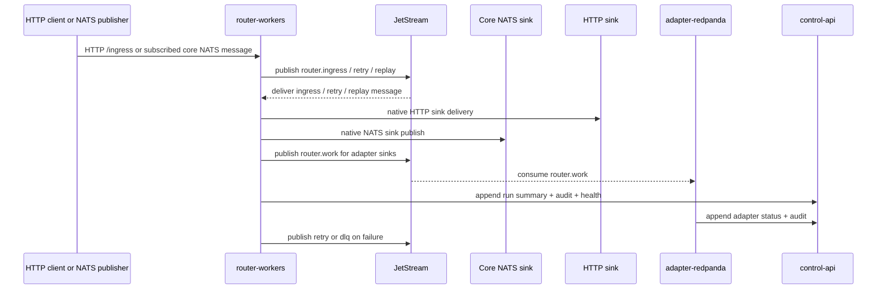

# Rohrpost

This repository is a Bun workspace implementation of the Event Router Platform described in [PLAN.md](./PLAN.md). It includes a Bun/Elysia control plane, a React console, a native Phase 2 routing runtime on NATS JetStream, a shared FlowSpec package, and deploy assets for local self-hosting.

## Current status

- Control plane is live: auth, tokens, flows, revisions, publish, rollback, replay requests, bounded debug runs, DLQ views, and capabilities.
- Native Phase 2 runtime is live: HTTP/NATS ingress, FlowSpec execution, HTTP/NATS sinks, retry, DLQ, replay, and aggregated runtime health reporting.
- Adapter execution is live for Kafka-style sink handoff: `router-workers` enqueue adapter work on `router.work.>` and `adapter-redpanda` consumes, records, and audits it.
- The console now includes a beta authoring workspace for prompt -> draft -> validation -> simulation -> publish.
- Authoring now auto-generates dedicated ingress targets from the flow name. Live samples are used for shape discovery, then `control-api` provisions a concrete HTTP path, NATS subject, or Kafka topic so users do not hand-edit source connector config.
- `runtime-manager` now performs live target probing, cached reconciliation snapshots, readiness checks, and rollout status updates for active deployments.

## Workspace layout

- `apps/control-api` — Elysia control plane with SQLite metadata and the v1 REST surface
- `apps/console` — React/Vite/TanStack console shell
- `apps/runtime-manager` — live reconciliation service for runtime target health and deployment rollout status
- `apps/router-workers` — native router worker runtime for Phase 2 event execution
- `apps/adapter-redpanda` — adapter capability and manifest service scaffold
- `packages/control-api-contracts` — typed control-plane HTTP contracts and client helpers
- `packages/domain-connectors` — shared connector capability catalog and source-binding logic
- `packages/shared-flow-spec` — FlowSpec types, validation, compiler, and simulation
- `deploy` — Docker Compose assets, local Kubernetes manifests, and deployment notes

The target domain-oriented monorepo layout is documented in [docs/monorepo-domain-layout.md](./docs/monorepo-domain-layout.md).

## Architecture

The system is split into a control plane, a runtime plane, and a bootstrap step for the shared broker.

- `control-api` is the source of truth. It owns auth, API tokens, connectors, capabilities, flow revisions, deployments, replay requests, bounded run summaries, aggregated runtime health summaries, and audit records. SQLite is only used here.
- `router-workers` own message execution. They load `GET /api/runtime/deployments/active` from `control-api`, subscribe to JetStream deployment subjects for ingress/retry/replay, optionally subscribe to configured core NATS source subjects, execute deterministic FlowSpec processors, and deliver to native sinks.
- For HTTP sources, `router-workers` still support the generic `POST /ingress` development path, but they now also honor connector-bound source paths such as `/ingest/customers-cleaned` directly.
- `adapter-redpanda` is only on the adapter path. `router-workers` publish adapter work items to `router.work.>`, and `adapter-redpanda` consumes that stream, records delivery outcomes, and reports adapter status back to `control-api`.
- `runtime-manager` is a reconciler, not part of the hot data path. It probes `control-api`, `router-workers`, and `adapter-redpanda`, keeps a cached reconciliation snapshot, exposes `/ready`, and writes rollout status such as `activated`, `pending_activation`, or `degraded` back to `control-api`.
- The broker has two roles. JetStream is the durable transport for the router's internal subjects: `router.ingress.>`, `router.work.>`, `router.retry.>`, `router.dlq.>`, `router.audit.>`, and `router.replay.>`. Core NATS subjects are used for external NATS ingress and egress such as `events.source.nats` and `events.sink.nats`.
- Stream bootstrap is required after a fresh NATS rollout. `deploy/nats/bootstrap.sh` and the Kubernetes `nats-bootstrap` job reconcile the canonical JetStream streams before `router-workers` and `adapter-redpanda` become ready.
- `packages/shared-flow-spec` is the contract between authoring and runtime. It defines `FlowSpec v1`, validation rules, compilation output, and simulation behavior.
- OTEL is still the intended system of record for detailed observability. The console is intentionally scoped to flow mapping, rollout posture, and coarse runtime health.

The delivery contract is explicit:

- at-least-once only
- ordering only per partition key
- duplicate delivery is possible
- retries are only allowed for idempotent sinks





## Quick start

```bash
bun install
bun run dev:control-api
```

The control API defaults to `http://localhost:3001` and persists metadata in `./data/control-plane.db`.

For the console against the real API instead of mock mode:

```bash
VITE_USE_MOCK_API=false \
VITE_API_BASE_URL=http://127.0.0.1:3001 \
VITE_API_TOKEN=dev-admin-token \
bun run dev:console
```

## File size guardrail

RFC `0008` is enforced with a lightweight shrink-only file budget check for tracked source files in `apps`, `packages`, `deploy/bin`, and `tools`.

```bash
bun run report:file-sizes
bun run check:file-sizes
```

- `report:file-sizes` prints the current non-empty LOC report.
- `check:file-sizes` fails if a file grows past its checked-in allowlist baseline, or if a new file exceeds the freeze threshold.
- The baseline and thresholds live in [tools/file-size-budgets.json](./tools/file-size-budgets.json).

## Local Kubernetes

The preferred real-life test path is now local Kubernetes, not five separate Bun terminals.

The repo includes a local-cluster workflow for `kind` and Docker Desktop Kubernetes:

```bash
bun run k8s:deploy
```

That builds real images, applies the manifests in [deploy/k8s](./deploy/k8s), bootstraps JetStream, and waits for the stack:

- `nats`
- `control-api`
- `router-workers`
- `adapter-redpanda`
- `runtime-manager`
- `console`
- `http-counting-sink`

Then expose the stack locally from a single terminal:

```bash
bun run k8s:port-forward
```

That gives you:

- console: `http://127.0.0.1:3000`
- control-api: `http://127.0.0.1:3001`
- router-workers: `http://127.0.0.1:3002`
- adapter-redpanda: `http://127.0.0.1:3003`
- runtime-manager: `http://127.0.0.1:7102`

Notes:

- the scripts auto-detect `kind-*` contexts and load images with `kind load docker-image`
- on Docker Desktop Kubernetes, the same scripts reuse the local Docker image store directly
- if your active context is `docker-desktop`, the same workflow works without `kind load docker-image`
- once the cluster is up, localhost access is only through `kubectl port-forward`; the services do not need to run directly on the host

For a long-run soak against the Kubernetes stack, pick the scenario that matches the active deployment instead of maintaining separate forwarding and load terminals:

```bash
bun run k8s:soak:nats-transform-nats
```

That NATS wrapper:

- port-forwards `control-api`, `router-workers`, and `nats` automatically
- auto-discovers the newest active `nats -> transform -> nats` deployment if `LOAD_TEST_DEPLOYMENT_ID` is not set
- subscribes to the sink subject and counts end-to-end deliveries locally
- runs a one-event preflight before the long test starts
- samples pod memory from Kubernetes instead of host PIDs
- writes the same progress and summary JSON artifacts under `/tmp`

For an explicit `http -> transform -> http` soak:

```bash
LOAD_TEST_DEPLOYMENT_ID=<deployment-id> \
bun run k8s:soak:http-transform-http
```

That wrapper still uses `router-workers` plus `http-counting-sink`, resets the sink counter, and requires an active deployment whose source is `http_in` and sink is `http_out`.

`bun run k8s:soak` now aliases the NATS scenario because the seeded local Kubernetes stack currently activates a native `nats -> transform -> nats` demo deployment by default.

## Real-life testing

The current repo supports two real local smoke scenarios:

- native delivery: `HTTP -> JetStream -> router-workers -> HTTP`
- native NATS delivery: `NATS -> router-workers -> NATS`
- adapter handoff: `HTTP -> JetStream -> router-workers -> adapter-redpanda`

The steps below use the local Bun services, not the full Compose stack, so they are easy to run while developing.

Before you start, make sure you do not already have old dev processes bound to the local service ports from an earlier attempt. The scenario assumes a clean local state or that you intentionally reuse already-running instances.

Useful checks:

```bash
lsof -nP -iTCP:3001 -sTCP:LISTEN || true
lsof -nP -iTCP:3002 -sTCP:LISTEN || true
lsof -nP -iTCP:3003 -sTCP:LISTEN || true
lsof -nP -iTCP:7102 -sTCP:LISTEN || true
```

If one of those ports is already in use by an old Bun watch process, stop it before retrying:

```bash
kill <pid>
```

### 1. Install dependencies

```bash
bun install
```

### 2. Start NATS and bootstrap the canonical streams

```bash
docker compose -f deploy/docker-compose.yml --profile bootstrap up -d nats nats-bootstrap
```

This provisions the JetStream streams used by the runtime:

- `router.ingress.>`
- `router.work.>`
- `router.retry.>`
- `router.dlq.>`
- `router.audit.>`
- `router.replay.>`

If `router-workers` starts returning `NatsError: 503` with `err_code: 10023` and `description: "insufficient resources"`, your local JetStream file store is full. Rerun the bootstrap command above to reconcile stream retention limits on the existing broker before retrying ingress traffic.

### 3. Start the services

Start each service in its own terminal.

The recommended local stack for all of the scenarios below includes all four services:

- `control-api`
- `router-workers`
- `adapter-redpanda`
- `runtime-manager`

Even if you only plan to run the native `HTTP -> HTTP` smoke first, still start `adapter-redpanda`. `runtime-manager` probes the full local runtime surface, and the adapter-backed scenario later in this section assumes that service is already running.

Control plane:

```bash
bun run dev:control-api
```

Router worker:

```bash
CONTROL_API_URL=http://127.0.0.1:3001 \
CONTROL_API_TOKEN=dev-admin-token \
NATS_URL=nats://127.0.0.1:4222 \
bun run dev:router-workers
```

Adapter runtime:

```bash
ADAPTER_REDPANDA_CONTROL_API_URL=http://127.0.0.1:3001 \
ADAPTER_REDPANDA_CONTROL_API_TOKEN=dev-admin-token \
ADAPTER_REDPANDA_NATS_URL=nats://127.0.0.1:4222 \
bun run dev:adapter-redpanda
```

Runtime manager:

```bash
CONTROL_API_URL=http://127.0.0.1:3001 \
CONTROL_API_TOKEN=dev-admin-token \
TENANT_ID=tenant_demo \
RUNTIME_MANAGER_ROUTER_WORKERS_URL=http://127.0.0.1:3002 \
RUNTIME_MANAGER_ADAPTER_REDPANDA_URL=http://127.0.0.1:3003 \
RUNTIME_MANAGER_REQUEST_TIMEOUT_MS=3000 \
bun run dev:runtime-manager
```

Defaults:

- `control-api`: `http://127.0.0.1:3001`
- `router-workers`: `http://127.0.0.1:3002`
- `adapter-redpanda`: `http://127.0.0.1:3003`
- `runtime-manager`: `http://127.0.0.1:7102`
- bootstrap token: `dev-admin-token`
- SQLite path: `./data/control-plane.db`

### 4. Confirm runtime health

Before creating any flows, confirm the local stack is healthy:

```bash
curl -s http://127.0.0.1:7102/ready
```

```bash
curl -s http://127.0.0.1:7102/status
```

```bash
curl -s http://127.0.0.1:3003/status
```

The important signals are:

- `runtime-manager /ready` returns `ok: true`
- `runtime-manager /status` shows healthy probes for `control-api`, `router-workers`, and `adapter-redpanda`
- `adapter-redpanda /status` shows `runtime.connected: true`

If you intentionally skip `adapter-redpanda`, `runtime-manager /status` will report the `adapter-redpanda` target as degraded. That is expected with the current probe model, but it means you are no longer following the full recommended local stack for this README.

### 5. Optional: start the console against the real API

In another terminal:

```bash
VITE_USE_MOCK_API=false \
VITE_API_BASE_URL=http://127.0.0.1:3001 \
VITE_API_TOKEN=dev-admin-token \
bun run dev:console
```

### Scenario A: native `HTTP -> HTTP`

### 6. Start a local HTTP sink

The seeded native `http_out_default` connector points to `http://127.0.0.1:4011/http-sink`. Start a trivial sink there:

```bash
truncate -s 0 /tmp/rohrpost-http-sink.jsonl

bun -e '
import { appendFileSync } from "node:fs";

const server = Bun.serve({
  hostname: "0.0.0.0",
  port: 4011,
  async fetch(request) {
    appendFileSync("/tmp/rohrpost-http-sink.jsonl", `${await request.text()}\n`);
    return new Response(null, { status: 200 });
  },
});

console.log(`HTTP sink listening on ${server.hostname}:${server.port}`);
await new Promise(() => {});
'
```

### 7. Create and publish a native flow

This uses the real drafting, create, and publish endpoints and prints the resulting identifiers:

```bash
bun -e '
const token = "dev-admin-token";
const headers = {
  authorization: `Bearer ${token}`,
  "content-type": "application/json",
};

const prompt = "Route HTTP checkout events to HTTP sink with static enrichment";
const name = "README HTTP Smoke";

const draftRes = await fetch("http://127.0.0.1:3001/api/flows/draft-from-prompt", {
  method: "POST",
  headers,
  body: JSON.stringify({
    prompt,
    name,
    tenantId: "tenant_demo",
    samplePayload: {
      orderId: "readme-smoke-1",
      amount: 123,
      customer: { email: "readme@example.com" },
    },
  }),
});

const draft = await draftRes.json();

const createRes = await fetch("http://127.0.0.1:3001/api/flows", {
  method: "POST",
  headers,
  body: JSON.stringify({
    name,
    tenantId: "tenant_demo",
    spec: draft.draft,
    samplePayload: {
      orderId: "readme-smoke-1",
      amount: 123,
      customer: { email: "readme@example.com" },
    },
  }),
});

const created = await createRes.json();

const publishRes = await fetch(`http://127.0.0.1:3001/api/flows/${draft.draft.metadata.flowId}/publish`, {
  method: "POST",
  headers,
  body: JSON.stringify({ revisionId: created.id }),
});

const published = await publishRes.json();

console.log(JSON.stringify({
  flowId: draft.draft.metadata.flowId,
  revisionId: created.id,
  deploymentId: published.deployment.id,
}, null, 2));
'
```

Copy the printed `deploymentId`, `flowId`, and `revisionId`. Then run one reconciliation tick so the deployment rollout status is updated from `pending_activation` to the observed runtime state:

```bash
curl -s -X POST http://127.0.0.1:7102/reconcile/run \
  -H 'content-type: application/json' \
  -d '{}'
```

### 8. Send a live event through the router worker

Replace `<deploymentId>` with the value returned above:

```bash
curl -s -X POST http://127.0.0.1:3002/ingress \
  -H 'content-type: application/json' \
  -d '{
    "deploymentId": "<deploymentId>",
    "messageId": "readme-success-1",
    "traceId": "readme-success-trace-1",
    "sourceRef": "manual-http-smoke",
    "partitionKey": "tenant_demo",
    "payload": {
      "orderId": "readme-order-1",
      "amount": 456,
      "customer": { "email": "customer@example.com" }
    }
  }'
```

Verify success:

```bash
cat /tmp/rohrpost-http-sink.jsonl
```

```bash
curl -s -H 'authorization: Bearer dev-admin-token' http://127.0.0.1:3001/api/runs
```

What you should see:

- the sink file contains the delivered envelope plus the transformed payload
- the payload includes `routedBy: "control-api"` and `mode: "native"`
- `GET /api/runs` contains a `succeeded` run for `traceId = readme-success-trace-1`
- `GET /ready` on `runtime-manager` still returns `ok: true`

### 9. Force a failure and replay from DLQ

Stop the HTTP sink from step 6, but keep `control-api` and `router-workers` running.

Send another event:

```bash
curl -s -X POST http://127.0.0.1:3002/ingress \
  -H 'content-type: application/json' \
  -d '{
    "deploymentId": "<deploymentId>",
    "messageId": "readme-failure-1",
    "traceId": "readme-failure-trace-1",
    "sourceRef": "manual-http-failure",
    "partitionKey": "tenant_demo",
    "payload": {
      "orderId": "readme-order-2",
      "amount": 999
    }
  }'
```

Check DLQ and failed runs:

```bash
curl -s http://127.0.0.1:3002/dlq
```

```bash
curl -s -H 'authorization: Bearer dev-admin-token' http://127.0.0.1:3001/api/dlq
```

Start the sink again on port `4011`, then create a replay request:

```bash
curl -s -X POST http://127.0.0.1:3001/api/replays \
  -H 'authorization: Bearer dev-admin-token' \
  -H 'content-type: application/json' \
  -d '{
    "flowId": "<flowId>",
    "revisionId": "<revisionId>",
    "reason": "README replay smoke",
    "sourceStream": "dlq"
  }'
```

Wait a few seconds for the worker poll loop, then check:

```bash
cat /tmp/rohrpost-http-sink.jsonl
```

```bash
curl -s -H 'authorization: Bearer dev-admin-token' http://127.0.0.1:3001/api/runs
```

Notes for this replay test:

- the current replay loop replays DLQ messages held by the running worker for the matching `flowId + revisionId`
- keep the router worker running between the forced failure and the replay
- use a clean test DB or a single failed message if you want replay output to stay easy to read

### Scenario B: adapter handoff `HTTP -> Kafka(adapter)`

### 10. Create and publish an adapter-backed flow

This flow uses a native HTTP source and an adapter-managed Kafka sink. It bypasses prompt inference and posts an explicit `FlowSpec` so the source stays HTTP.

```bash
bun -e '
const token = "dev-admin-token";
const headers = {
  authorization: `Bearer ${token}`,
  "content-type": "application/json",
};

const flowId = "flow_readme_adapter_smoke";
const revisionId = "rev_readme_adapter_smoke_v1";
const spec = {
  version: 1,
  metadata: {
    tenantId: "tenant_demo",
    flowId,
    revisionId,
    name: "README Adapter Smoke",
    description: "Native HTTP ingress with adapter-managed Kafka egress",
    tags: ["native", "adapter"],
  },
  sources: [
    {
      id: "source_primary",
      kind: "http",
      connector: {
        capabilityId: "http_in",
        connectorId: "http_in_default",
        executionMode: "native",
      },
      stream: "ingress",
      nextNodeIds: ["processor_enrich"],
    },
  ],
  processors: [
    {
      id: "processor_enrich",
      kind: "enrich_static",
      values: {
        routedBy: "control-api",
        mode: "adapter",
      },
      nextNodeIds: ["route_terminal"],
    },
  ],
  routes: [
    {
      id: "route_terminal",
      fromNodeId: "processor_enrich",
      predicate: { type: "always" },
      toSinkIds: ["sink_primary"],
      priority: 100,
    },
  ],
  sinks: [
    {
      id: "sink_primary",
      kind: "kafka",
      connector: {
        capabilityId: "kafka_out",
        connectorId: "kafka_out_default",
        executionMode: "adapter",
      },
      deliveryGuarantee: "append_only",
      stream: "work",
    },
  ],
  retryPolicy: {
    maxAttempts: 1,
    initialBackoffMs: 250,
    maxBackoffMs: 5000,
    multiplier: 2,
    retryableStatusCodes: [408, 429, 500, 502, 503, 504],
  },
  dlqPolicy: {
    enabled: true,
    sinkId: "sink_primary",
    reasonFormat: "json",
  },
  batchingPolicy: {
    enabled: false,
    batchSize: 1,
  },
  idempotencyStrategy: "message_id",
};

const createRes = await fetch("http://127.0.0.1:3001/api/flows", {
  method: "POST",
  headers,
  body: JSON.stringify({
    name: spec.metadata.name,
    tenantId: spec.metadata.tenantId,
    spec,
    samplePayload: {
      orderId: "adapter-smoke-1",
      amount: 321,
      customer: { email: "adapter@example.com" },
    },
  }),
});

const created = await createRes.json();

const publishRes = await fetch(`http://127.0.0.1:3001/api/flows/${flowId}/publish`, {
  method: "POST",
  headers,
  body: JSON.stringify({ revisionId: created.id }),
});

const published = await publishRes.json();

console.log(JSON.stringify({
  flowId,
  revisionId: created.id,
  deploymentId: published.deployment.id,
}, null, 2));
'
```

Run reconciliation again:

```bash
curl -s -X POST http://127.0.0.1:7102/reconcile/run \
  -H 'content-type: application/json' \
  -d '{}'
```

### 11. Send a live event into the adapter-backed flow

Replace `<deploymentId>` with the deployment from the previous step:

```bash
curl -s -X POST http://127.0.0.1:3002/ingress \
  -H 'content-type: application/json' \
  -d '{
    "deploymentId": "<deploymentId>",
    "messageId": "readme-adapter-1",
    "traceId": "readme-adapter-trace-1",
    "sourceRef": "manual-http-adapter-smoke",
    "partitionKey": "tenant_demo",
    "payload": {
      "orderId": "adapter-order-1",
      "amount": 654,
      "customer": { "email": "adapter-customer@example.com" }
    }
  }'
```

Verify the handoff:

```bash
curl -s http://127.0.0.1:3003/deliveries
```

```bash
tail -n 1 apps/adapter-redpanda/data/adapter-deliveries.jsonl
```

```bash
curl -s -H 'authorization: Bearer dev-admin-token' http://127.0.0.1:3001/api/runs
```

What you should see:

- `adapter-redpanda /deliveries` contains a `delivered` record for `traceId = readme-adapter-trace-1`
- the delivery record includes `capabilityId: "kafka_out"` and topic `router.egress.kafka`
- the local JSONL log contains the same work item and delivery record
- `GET /api/runs` shows a successful router run because the adapter handoff succeeded

Current limitation of this smoke:

- this proves adapter handoff and adapter processing inside the local stack
- it does not yet prove delivery into a real external Kafka broker

### 12. Shut everything down

Stop the local Bun processes with `Ctrl-C`, then tear down Docker services:

```bash
docker compose -f deploy/docker-compose.yml --profile bootstrap down
```

## Implemented scope

- Bun workspace monorepo structure
- SQLite control-plane schema and seed data
- Flow draft, validate, create, publish, rollback, replay, capabilities, run, and DLQ endpoints
- Shared FlowSpec schema, validation, compilation, and simulation
- Native Phase 2 router execution over NATS JetStream
- Adapter-managed Kafka-style sink handoff with runtime delivery logs and audit fanout
- Runtime-manager health probing, cached snapshots, readiness checks, and deployment rollout reconciliation
- Console shell and deploy assets

## Notes

- v1 guarantees are explicitly at-least-once with ordering only per partition key.
- JetStream is the active durability layer for the native Phase 2 path.
- The repo is still pre-beta. Full infrastructure orchestration and real external warehouse or broker delivery are not complete yet.
