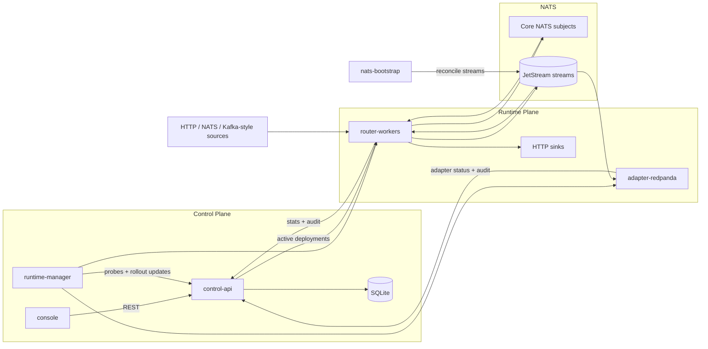
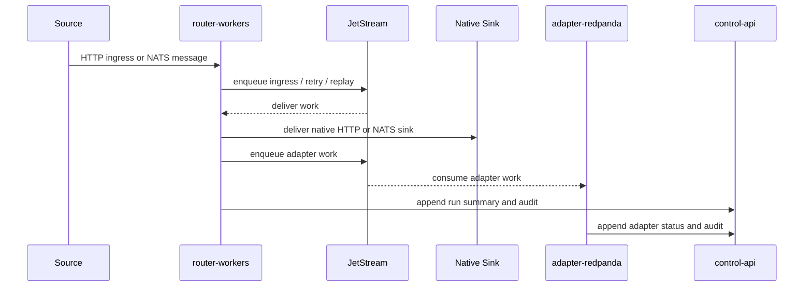

# Rohrpost

Use Rohrpost when you want to turn raw website, webhook, NATS, or Kafka events into governed event routes without wiring every source and sink by hand. It gives you a control plane for authoring flows, a runtime plane for durable delivery, and a console for inspecting what is active.

Rohrpost is currently a Bun workspace with a local self-hosted stack. It is built around explicit delivery semantics: at-least-once delivery, per-partition ordering only, possible duplicates, and retries only for idempotent sinks.

## Start Locally

Install dependencies:

```bash
bun install
```

Start the control API:

```bash
bun run dev:control-api
```

The control API runs at `http://localhost:3001` and uses `dev-admin-token` in development.

Start the console against the real API:

```bash
VITE_USE_MOCK_API=false \
VITE_API_BASE_URL=http://127.0.0.1:3001 \
VITE_API_TOKEN=dev-admin-token \
bun run dev:console
```

Open `http://localhost:5173`.

## Start The Runtime Stack

For the full local runtime, use Docker Compose:

```bash
docker compose -f deploy/docker-compose.yml --profile bootstrap up --build
```

This starts:

- NATS JetStream
- `control-api`
- `router-workers`
- `adapter-redpanda`
- `runtime-manager`

To include the production-style console container:

```bash
docker compose \
  -f deploy/docker-compose.yml \
  -f deploy/docker-compose.console.yml \
  --profile bootstrap \
  up --build
```

Useful local ports:

- `control-api`: `http://127.0.0.1:3001`
- `nats`: `127.0.0.1:4222`, monitoring at `http://127.0.0.1:8222`
- `adapter-redpanda`: `http://127.0.0.1:3003`
- `runtime-manager`: `http://127.0.0.1:3002`
- `console`: `http://127.0.0.1:5173` in dev, `http://127.0.0.1:3000` in Compose

In Compose, `router-workers` is internal. Use the Kubernetes port-forward helper when you need to hit it from the host.

## Local Kubernetes

For a closer deployment shape, use the bundled Kubernetes manifests with Docker, kind, kubectl, and Bun:

```bash
kind create cluster --name rohrpost
K8S_CONTEXT=kind-rohrpost bun run k8s:deploy
bun run k8s:port-forward
```

`bun run k8s:deploy` runs [deploy/bin/k8s-deploy.sh](deploy/bin/k8s-deploy.sh). It builds local images, loads them into kind when the active context is `kind-*`, applies [deploy/k8s](deploy/k8s), bootstraps NATS JetStream, and waits for the stack.

`bun run k8s:port-forward` runs [deploy/bin/k8s-port-forward.sh](deploy/bin/k8s-port-forward.sh). Keep it open while testing; it creates the stable localhost ports below.

The port-forward helper exposes:

- console: `http://127.0.0.1:3000`
- control-api: `http://127.0.0.1:3001`
- router-workers: `http://127.0.0.1:3002`
- adapter-redpanda: `http://127.0.0.1:3003`
- runtime-manager: `http://127.0.0.1:7102`

Run the seeded NATS soak test:

```bash
bun run k8s:soak:nats-transform-nats
```

Run an HTTP transform soak after publishing an HTTP deployment:

```bash
LOAD_TEST_DEPLOYMENT_ID=<deployment-id> \
bun run k8s:soak:http-transform-http
```

## Architecture

Rohrpost is split into a control plane, a runtime plane, and NATS JetStream.

- `apps/control-api` owns auth, API tokens, connector catalog, flow revisions, deployments, replay requests, runtime summaries, and audit records. SQLite is only used here.
- `apps/console` is the React/Vite management UI.
- `apps/router-workers` execute active FlowSpecs. They accept HTTP ingress, subscribe to configured NATS subjects, enqueue durable ingress/retry/replay work, and deliver to native HTTP/NATS sinks.
- `apps/adapter-redpanda` consumes adapter work from JetStream for adapter-managed sinks such as Kafka-style handoff.
- `apps/runtime-manager` reconciles runtime health and rollout state. It is not in the hot path.
- `packages/shared-flow-spec` defines FlowSpec v1, validation, compilation, predicates, and simulation.
- `packages/domain-connectors` defines source and sink capabilities plus source-binding helpers.
- `packages/control-api-contracts` contains the shared control-plane contracts.



## Data Flow



## Authoring Flows

The control API can draft, validate, save, and publish flows:

```bash
curl -s http://127.0.0.1:3001/api/flows/draft-from-prompt \
  -H 'authorization: Bearer dev-admin-token' \
  -H 'content-type: application/json' \
  -d '{"prompt":"Send website purchase events to S3","samplePayload":{"event":"purchase","total":42}}'
```

For agent-based authoring, install the bundled skill:

```bash
npx skills add vorcigernix/rohrpost --skill rohrpost
```

## Integrations

- `integrations/gtm/` contains a Google Tag Manager Custom HTML snippet that mirrors `dataLayer.push(...)` messages into a Rohrpost HTTP ingress endpoint.

## Checks

```bash
bun run typecheck
bun test
bun run build:console
```

The repository also has a file-size guardrail:

```bash
bun run check:file-sizes
```
